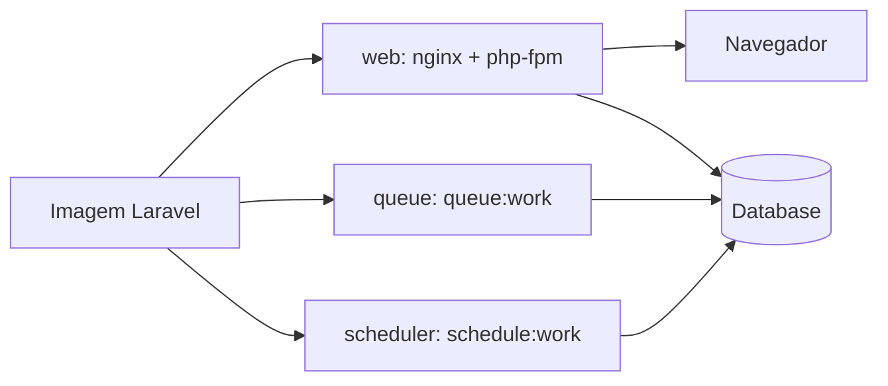

# Arquitetura Docker De Produção

Este projeto é um starter kit Laravel 13 com PHP 8.5, Inertia React, Vite Plus,
Bun e Wayfinder. A imagem de produção é uma única imagem reutilizada por roles
separados no runtime.

## Topologia



## Build Da Imagem

O `Dockerfile` usa multi-stage:

1. `php-base`: PHP 8.5 FPM Alpine, Composer, Bun e extensoes PHP.
2. `composer-deps`: instala dependencias PHP de producao com `composer install
   --no-dev`, sem ignorar requisitos de plataforma.
3. `assets`: copia o contexto Laravel suficiente para Wayfinder e roda
   `bun install --frozen-lockfile` e `bun run build`.
4. `production`: copia codigo, `vendor`, `public/build` e configura Nginx/PHP.

O build nao gera cache de config no Dockerfile. O cache de Laravel depende das
variaveis de ambiente reais e acontece no boot do container.

## Roles De Runtime

O entrypoint aceita um primeiro argumento:

```bash
docker run image web
docker run image queue
docker run image scheduler
```

- `web`: inicia `php-fpm` em background e deixa `nginx` em foreground.
- `queue`: executa `php artisan queue:work`.
- `scheduler`: executa `php artisan schedule:work`.

Todos os roles preparam `storage/` e `bootstrap/cache`, rodam
`storage:link --force` por padrao e executam `optimize:clear` + `optimize` por
padrao. Migrations sao opcionais via `RUN_MIGRATIONS=true`.

## Variaveis Relevantes

Build args:

| Variavel | Valores |
|---|---|
| `PHP_VERSION` | Default `8.5` |
| `DB_DRIVERS` | `sqlite`, `pgsql`, `mysql` |
| `EXTRA_PECL` | `redis`, `mongodb`, `imagick`, `memcached` |
| `EXTRA_EXT` | `gmp`, `soap`, `sockets`, `calendar` |

Runtime:

| Variavel | Default | Uso |
|---|---|---|
| `RUN_MIGRATIONS` | `false` | Roda migrations no boot quando `true` |
| `RUN_STORAGE_LINK` | `true` | Gera `public/storage` |
| `RUN_LARAVEL_OPTIMIZE` | `true` | Regera caches de producao |
| `FORCE_HTTPS` | `false` | Forca URLs HTTPS quando a app deve gerar links seguros por conta propria |
| `QUEUE_SLEEP` | `3` | Delay do `queue:work` |
| `QUEUE_TRIES` | `3` | Tentativas por job |
| `QUEUE_MAX_TIME` | `3600` | Tempo maximo do worker antes de reiniciar |

## Nginx E PHP

Nginx serve `/build/assets` com cache imutavel, entrega arquivos de
`/storage`, encaminha o restante para `index.php` e expõe `/health` para load
balancers. Logs de Nginx vao para stdout/stderr.

PHP-FPM escuta em `127.0.0.1:9000`. OPcache fica ativo com
`validate_timestamps=0`. Preload e JIT ficam desativados por padrao para manter
a imagem generica e menos fragil.

## CI/CD

`.github/workflows/docker-publish.yml` publica a imagem no GHCR em pushes para
`main`, tags `v*.*.*` e `workflow_dispatch`. O workflow usa cache de BuildKit e
builda `linux/amd64`.

## SSR

O build atual usa CSR com `bun run build`. O projeto possui `resources/js/ssr.tsx`,
mas SSR nao esta ativo nesta imagem. Para habilitar SSR depois, sera necessario
buildar o bundle SSR e adicionar um runtime Node ou sidecar dedicado para
`php artisan inertia:start-ssr`.
